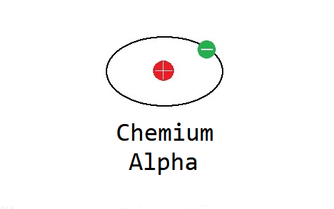

# Chemium #
## Overview ##
Chemium (abbreviated as Che) is a technology mod for Minecraft. It incorporates various items from modern industry—such as steel, plastic, and concrete—allowing you to build factories and automate their production!

This mod emphasizes high realism, but consequently presents greater challenges (potentially rivaling GregTech in complexity). It’s a fun and engaging experience! Currently in Alpha stage, Chemium may encounter crashes or freezes. If you experience these issues, please report them via GitHub issues.

## Frequently Asked Questions ##
Q: Will there be backports to older Minecraft versions?  
A: Never, though community backports are welcome.

## Special Thanks ##
- The development team of Minecraft: Education Edition
- GregoriusT and the GregTechCEu team
- The developers of Mekanism

---

# 化学工业 #
## 概述 ##

化学工业（简称化工 / Che）是Minecraft的一个科技模组。模组中含有现代工业中的各种物品，如钢铁、塑料、混凝土，你可以制作自己的工厂来生产它们！

这个模组极为真实，但相对的，难度也会更高（可能与GregTech媲美）。这是一个有趣的模组！Chemium 目前处于 Alpha 版本，可能出现崩溃 / 卡死的错误，遇到这些问题请提交 Github Issue。

## 常见问题 ##
Q: 是否会向下移植？

A: 永远不会，但是欢迎玩家们移植。

## 特别鸣谢 ##
- Minecraft 教育版的开发团队
- GregoriusT 与 GregTechCEu 团队
- Mekanism 的开发者们